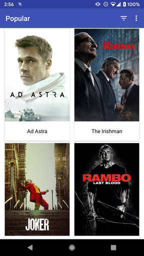

# PopularMovies

Android App demonstrating the use of API requests, SQLite, and more.

 &nbsp; 

## API Keys

You'll need API Keys for YouTube, [The Movie DB](https://www.themoviedb.org/documentation/api)).
Add a file called "api.properties" in the project root folder with the following fields...
 
`YOUTUBE  = YOUTUBE_KEY`       
`MOVIE_V3 = MOVIE_API_KEY_V3`  
`MOVIE_V4 = MOVIE_API_KEY_V4`  
